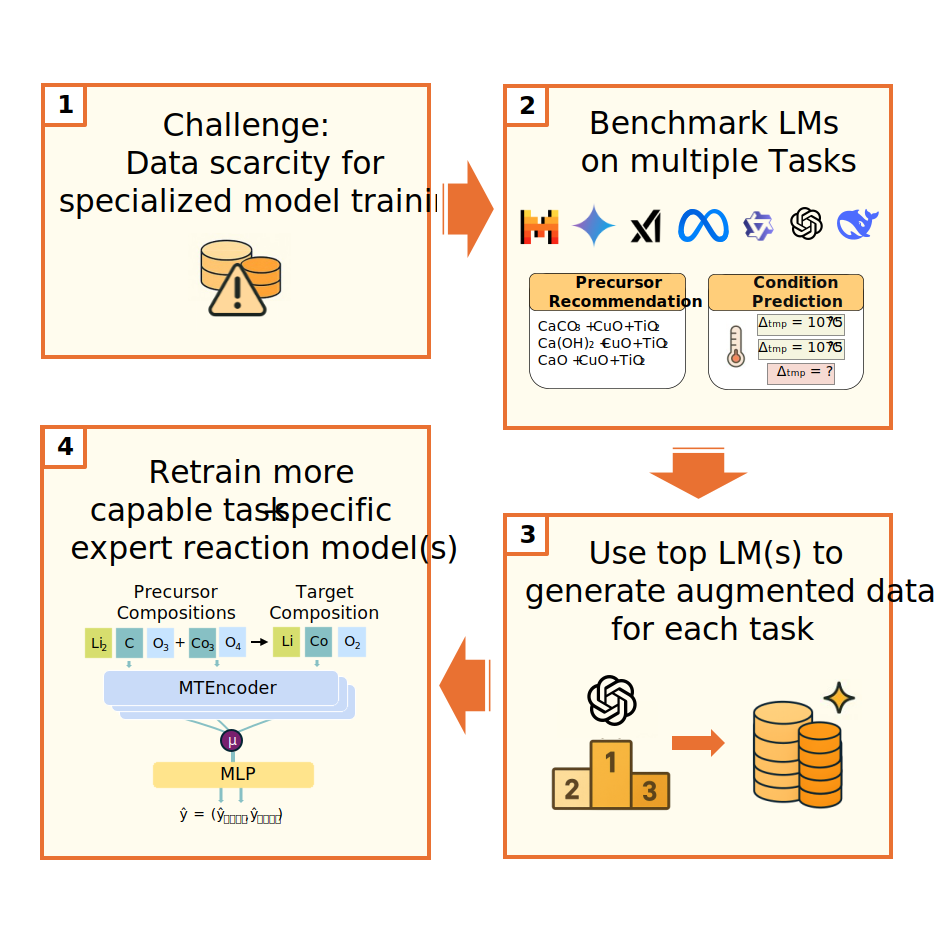

<div align="center">


# LM-Dataset Generation for Inorganic Materials Synthesis

[](https://www.python.org/downloads/)
[](LICENSE)
[](https://github.com/psf/black)
[](https://huggingface.co/datasets/thor1/LLMForge)


</div>

---

## 🎯 Overview

This repository provides tools for **generating large-scale synthetic datasets** and **evaluating Language Models** for inorganic materials synthesis. We leverage state-of-the-art LMs (GPT-4, Gemini, Llama) to automatically generate realistic synthesis recipes and benchmark their performance on curated test/validation datasets.

### 🔥 Key Features

- **🤖 Multi-LM Support**: Evaluate GPT-4, Gemini 2.0, Llama, and more
- **⚗️ Dual Task Evaluation**: Benchmark precursor prediction and synthesis conditions  
- **📊 Comprehensive Evaluation**: Built-in metrics and validation on test/val sets

## 🏗️ Architecture

<div align="center">

<p><em>LM-based dataset generation pipeline: from target materials to synthetic synthesis recipes</em></p>
</div>

## 🚀 Quick Start

## 🛠️ Installation

### Prerequisites
- Python 3.9 or higher
- A virtual environment manager like `uv` or `conda`
- API keys for your preferred Language Models

### Setup Instructions

1. **Clone the repository**
   ```bash
   git clone https://github.com/janik-j/LM-Dataset-Generation.git
   cd "LM-Dataset-Generation"
   ```

2. **Create and activate environment (using uv)**
   ```bash
   uv venv

   # On Windows
   .venv\Scripts\activate

   # On macOS/Linux
   source .venv/bin/activate
   ```

3. **Install dependencies**
   ```bash
   uv pip install -r requirements.txt
   ```

### API Configuration

Create a `.env` file with your API keys:

```env
GEMINI_API_KEY=your_gemini_api_key_here
OPENAI_API_KEY=your_openai_api_key_here
XAI_API_KEY=your_xai_api_key_here
OPENROUTER_API_KEY=your_openrouter_api_key_here
```

### 🤖 Model Evaluation & Data Generation

```bash
# 📊 EVALUATE MODELS on validation/test sets
# Evaluate precursor prediction on validation set
python predictions.py --task retrosynthesis --model gemini-2.0-flash-001 --val --max-samples 100

# Benchmark synthesis conditions on validation set
python predictions.py --task conditions --model gpt-4o --val --max-samples 500

# 🤖 GENERATE SYNTHETIC DATASETS
# Generate precursor sets for training data
python predictions.py --task retrosynthesis --model gemini-2.0-flash-001 --inference --max-samples 1000 --no-fixed-precursor-len

# Generate synthesis conditions for model training
python predictions.py --task conditions --model gpt-4o --inference --max-samples 500

```

## 📋 Command Line Options

| Option | Description | Default |
|--------|-------------|---------|
| `--task` | Task type: 'retrosynthesis' or 'conditions' | retrosynthesis |
| `--model` | Model name(s) to evaluate | All models |
| `--val` | Use validation dataset | True |
| `--test` | Use test dataset | False |
| `--max-samples` | Maximum samples to process | All |
| `--few-shot-examples` | Number of few-shot examples | 2 |
| `--no-fixed-precursor-len` | Allow variable number of precursors | False |
| `--inference` | Run on the inference dataset | False |
| `--start-index` | Start index for batching | 0 |
| `--end-index` | End index for batching | None |
| `--output-dir` | Directory to save results | `results` |
| `--list-models` | List available models | False |


### Usage Examples

<details>
<summary>📋 Click to expand usage examples</summary>

```bash
# List all available models
python predictions.py --list-models

# Single model evaluation
python predictions.py --task retrosynthesis --model gemini-2.0-flash-001 --val --max-samples 100

# Multi-model ensemble
python predictions.py --task retrosynthesis --model gpt-4o gemini-2.0-flash-001 --val

# Condition prediction with few-shot learning
python predictions.py --task conditions --model gpt-4o --few-shot-examples 5 --val

# Full evaluation on test set
python predictions.py --task retrosynthesis --model gemini-2.5-pro-exp-03-25 --test --val

# Run inference with variable precursor length on a subset of data
python predictions.py --task retrosynthesis --model "mistralai/mistral-small-3.1-24b-instruct" --inference --no-fixed-precursor-len --start-index 0 --end-index 10
```

</details>

## 📂 Project Structure

```
LM-Dataset-Generation/
├── 📁 assets/              # Figures and visual assets
├── 📁 datasets/            # Evaluation and generation datasets
├── 📁 evaluation/          # Model evaluation and dataset validation
├── 📁 results/             # Model predictions and generated datasets
├── 📁 logs/                # Execution logs and monitoring
├── predictions.py          # 🎯 Main evaluation & generation script
├── utils.py               # Model and generation utilities
├── requirements.txt       # Dependencies
└── README.md             # This file
```

## 📈 Model Evaluation & Dataset Analysis

### 1. Convert Results to JSON
```bash
python evaluation/convert_results_to_json.py -d "input_dir" -o "output_dir"
```

### 2. Calculate Accuracy Metrics
```bash
# Retrosynthesis evaluation
python evaluation/eval_retrosynthesis.py --results_dir "results/results_precursor_json"

# Condition prediction evaluation  
python evaluation/eval_conditions.py --results_dir "results/results_conditions"
```

### Evaluation Metrics

#### Retrosynthesis Task
- **Top-k Accuracy**: Measures if the ground truth precursors appear within the top-k predictions
- **Exact Match**: Requires perfect match between predicted and ground truth precursor sets
- **Subset Match**: Allows ground truth to be a subset of predicted precursors

#### Synthesis Conditions Task
- **R² Score**: Coefficient of determination measuring prediction quality
- **MAE (Mean Absolute Error)**: Average absolute difference between predicted and actual values
- **RMSE (Root Mean Square Error)**: Square root of mean squared errors, penalizing larger deviations
- **Valid Count (N)**: Number of samples with valid predictions for each parameter

The conditions evaluation script processes the following synthesis parameters:
- Sintering Temperature
- Sintering Time  
- Calcination Temperature
- Calcination Time

Results are displayed in ranked tables (by R² score) and scatter plots are generated for temperature parameters.

## 📝 Citation

If you use this work in your research, please cite our paper:

```bibtex
@article{Prein2025SyntMTE,
  author    = {Prein, Thorben and Pan, Elton and Jehkul, Janik and Weinmann, Steffen and Olivetti, Elsa A. and Rupp, Jennifer L. M.},
  title     = {Language Models Enable Data-Augmented Synthesis Planning for Inorganic Materials},
  journal   = {ACS Applied Materials & Interfaces},
  year      = {2025},
  note      = {Under Review}
}
```

<div align="center">

</div>